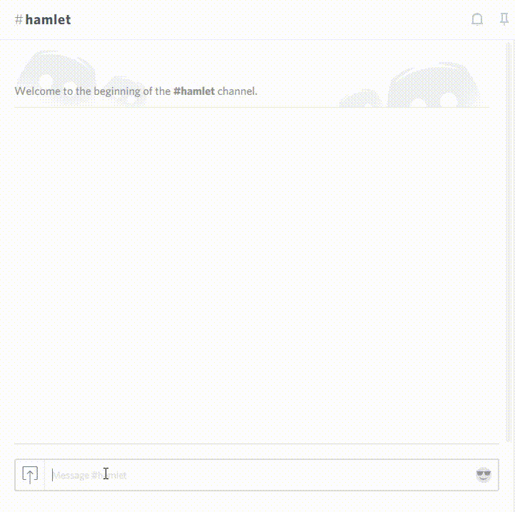

# About

Hamlet on Discord!

This is a simple NodeJS program that uses multiple Discord bots to perform a play such as Hamlet:

# Usage

First, you need to make sure you have three Discord bots at your disposal. Creating Discord bots is outside of the scope of this readme.
All bots need to be connected with the same Discord server.
Once you have three bots, create a file called `config.json` with the following content:

    {
      "directorToken": "<DISCORD BOT TOKEN HERE>",
      "actor1Token": "<DISCORD BOT TOKEN HERE>",
      "actor2Token": "<DISCORD BOT TOKEN HERE>",
      "channelName": "<NAME OF DISCORD CHANNEL THE BOTS SHOULD ACT IN>"
    }

Next, simply run `node index.js`, and type "!hamlet" in the correct Discord channel!